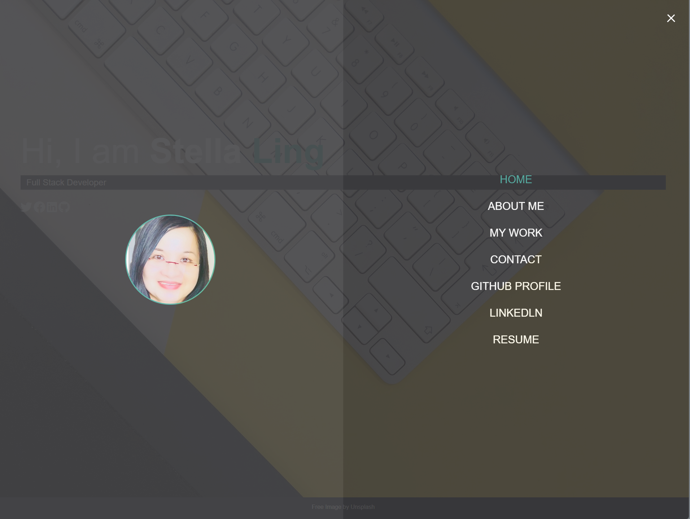

## 16 Project 2: Professional Materials

## Description

The task is to provide an update to the portfolio page and materials to build toward being employer-competitive.  The portfolio is updated to show the projects that I have done.  This is displayed on "My Work" in my deployed portfolio application, that is, the URL of the deployed application is:-

 https://stellalph.github.io/MY-PORTFOLIO/.  
 
 The URL of the GitHub repository for the updated professional materials is :-
 
 https://github.com/stellalph/MY-PORTFOLIO.git.

The name of the repository is MY-PORTFOLIO.

## Table of Contents

* [Portfolio](#portfolio)
* [Github Profile](#githubprofile)
* [Linkedln](#linkedln)
* [Resume](#resume)
* [References](#references)
* [License](#license)

## Portfolio

The technologies used for this portfolio application :-

    *   HTML5
    *   CSS3
    *   Javascript
    *   Node.js
    *   npm (node-sass)

This application requires the installation of node.js and npm package, node-sass. Node Package Manager (npm) is a software manager and installer which puts the modules in place so that the node project can utilize it, and also, it manages dependency conflicts intelligently and initialized using npm init.  The package.json will be generated and will contains all the details of the application in which the user have inputted during the npm initialization.

This application requires the installation of npm install node-sass and the following structure.  The code written in scss folder will be imported to the main.css at the command prompt, npm run sass and the deployment command for this application is npm run ghdeploy.

The steps to view my portfolio application :-

* Click on the link below to view my portfolio application:-

    * [Portfolio Link](https://stellalph.github.io/MY-PORTFOLIO)

    * 

*   Click on the hamburger icon will bring on the menu :-

    * Home (the introduction page)
    * About Me (Who Am I page and the skills acquired)
    * My Work (I have displayed eight of my favourite works)
    * Contact (display of my contact information, email address, phone number and current location)
    * Link to my GitHub profile (which will open up to a new tab)
    * Link to my Linkedln profile (which will open up to a new tab)
    * Link to a downloadable PDF of my resume

    * 

 * Click on the "Home" will bring back the Introduction Page and clicking on "About Me" will bring on the page below :-

   * 

* Click on "My Work" will bring the list of projects or homeworks that I have completed.  The projects listed have link to the deployed version or video walkthrough (grey area) and GitHub URL :-

    * 

  The projects listed have link to the deployed version or video walkthrough (grey area) and GitHub URL, for example, the Note Taker and they open up to a new tab for easy viewing.

    * 

* The application is also responsive and caters for mobile, tablets, desktop and large screens.

    * 
    * 

* To further demonstrate the responsiveness of the application :-

  * 
 
## Github Profile

Clicking on the "Github Profile" in portfolio application will bring on a new tab to my Github profile:-

* 

* 

Here, my profile picture, biography, email address, link to my deployed portfolio and pinned repositories have been updated.  Every pinned respository have least at 20 commits and include all the criteria as listed.

## Linkedln

Clicking on the "Linkedln" in portfolio application will bring on a new tab to my Linkedln:-

* 

A brief mention on building up my skillsets.

* 

## Resume

Clicking on the "Resume" in portfolio application will bring on a new tab to my downloadable PDF copy of the resume:-

* 

## References

* Dev Community - Cheatsheet for Web Developers (Section on SASS Documentation)
https://dev.to/suprabhasupi/cheatsheet-for-web-developers-1op
* How to Use HTML to Open a Link in a New Tab by Kris Koishigawa 
https://www.freecodecamp.org/news/how-to-use-html-to-open-link-in-new-tab/
* Nodejs SASS npm library
https://www.cloudhadoop.com/node-sass-npm-example/
* Youtube Tutorial on Node SASS on www.google.com.au
* Deployment of the application
https://wgist.github.com/joshuapekera

## License

This project is licensed under the terms of the MIT license.
 